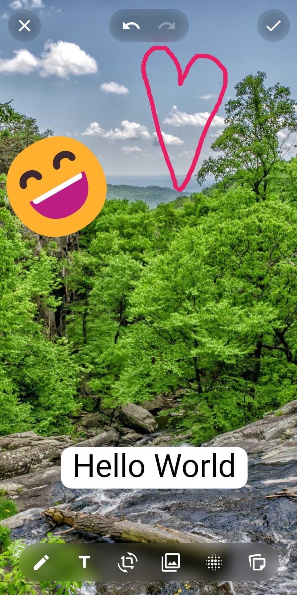
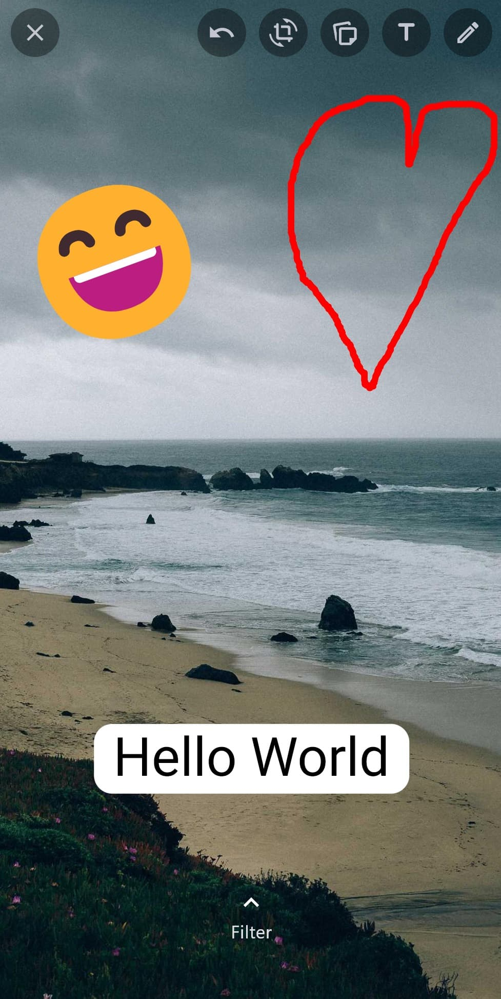
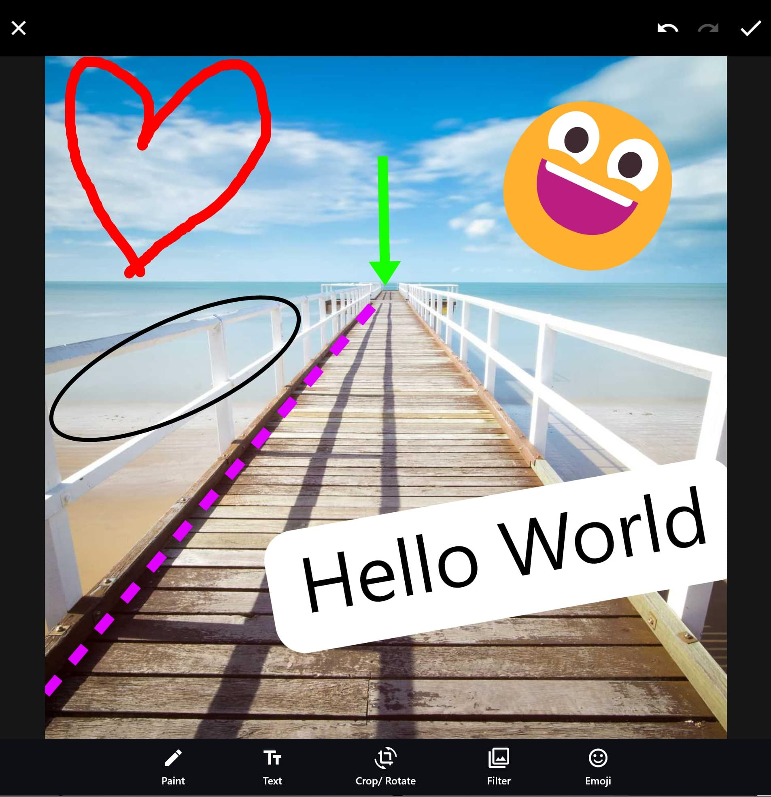

# Pro Image Editor

A Flutter image editor: Seamlessly enhance your images with user-friendly editing features.





## Features

- Multi-layer image editing
- Paint, crop, rotate, blur, filter, and emoji editing
- Add stickers, text, and custom widgets
- Export/import editor state
- High-quality image generation
- Signature drawing
- Google Fonts integration
- Customizable UI (app bar, bottom bar, etc.)
- Platform support: Android, iOS, Web, macOS, Windows, Linux

## Getting Started

Add the package to your `pubspec.yaml`:

```yaml
pro_image_editor:
```

Then run:

```sh
flutter pub get
```

## Usage

Import the main package:

```dart
import 'package:pro_image_editor/pro_image_editor.dart';
```

### Basic Example

```dart
import 'package:flutter/material.dart';
import 'package:pro_image_editor/pro_image_editor.dart';

class MyEditorPage extends StatelessWidget {
  @override
  Widget build(BuildContext context) {
    return Scaffold(
      appBar: AppBar(title: Text('Image Editor')),
      body: ProImageEditor(
        image: AssetImage('assets/sample.jpg'),
        // Configure options as needed
      ),
    );
  }
}
```

## Example App

This package includes a comprehensive example app demonstrating all features and editor modes. To run the example:

```sh
cd example
flutter run
```

The example app showcases:
- Default editor
- Standalone editors (paint, crop, filter, etc.)
- Signature drawing
- Stickers and emoji
- Import/export state
- Google Fonts
- Custom UI integrations

## API Overview

The main exports include:
- `ProImageEditor` widget
- Standalone editors: `PaintEditor`, `TextEditor`, `CropRotateEditor`, `FilterEditor`, `BlurEditor`, `EmojiEditor`, `StickerEditor`
- Configs: `ProImageEditorConfigs`, `PaintEditorInitConfigs`, etc.
- Callbacks for editor events
- Utility methods for image conversion and high-quality export

## Screenshots

| Frosted Glass | WhatsApp Design | Simple Design |
|:-------------:|:---------------:|:-------------:|
|  |  |  |

## Issues & Contributions

Feel free to open issues or submit pull requests to help improve this package!

## License

[MIT](LICENSE)

---
